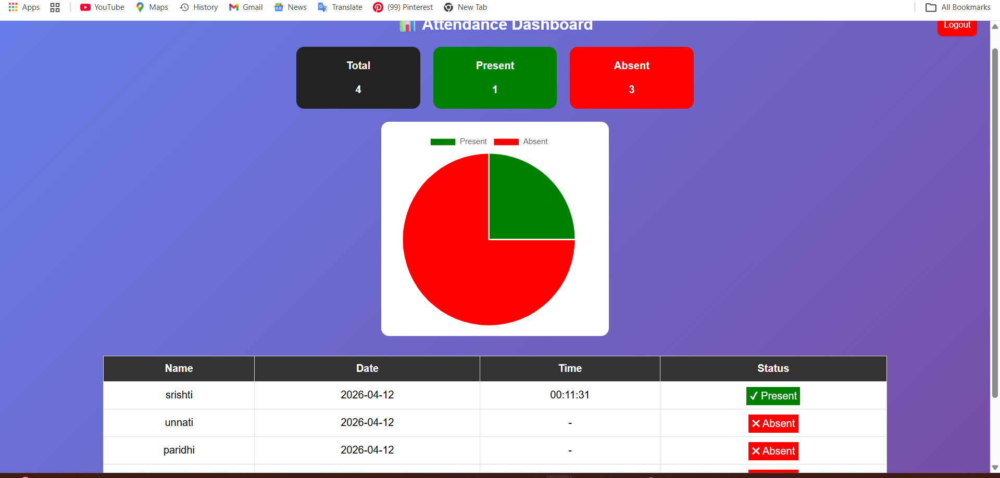

# 🎯 Smart Attendance System

A real-time face recognition-based attendance system built using Python, OpenCV, and Flask.  
The system detects faces through a webcam, recognizes individuals, and automatically marks attendance with date and time.

---

## 🚀 Features

- 🎥 Real-time face detection and recognition  
- 🧠 Automatic attendance marking  
- 📊 Dashboard with present/absent status  
- 🔐 Login & Logout authentication system  
- 🟢 Live camera feed with name display  
- 📈 Attendance visualization using charts  

---

## 🛠️ Tech Stack

- Python  
- OpenCV  
- Flask  
- HTML, CSS, JavaScript  
- Git & GitHub  

---

## 📂 Project Structure

```
Smart-Attendance/
│
├── app.py
├── attendance.csv
├── dataset/
├── templates/
│   ├── index.html
│   ├── camera.html
│   ├── dashboard.html
│   └── login.html
```

---

## ▶️ How to Run

1. Clone the repository  
```
git clone https://github.com/srishtiagarwal19/smart-attendance-system.git
```

2. Install required libraries  
```
pip install opencv-python face-recognition flask numpy
```

3. Run the application  
```
python app.py
```

4. Open browser  
```
http://127.0.0.1:5000
```

---

## 🔐 Login Credentials

```
Username: admin  
Password: admin@1234
```

---

## 📸 Screenshots

### 🏠 Home Page


### 📷 Camera Detection


### 📊 Dashboard


### 🔐 Login Page

---

## 💡 Future Improvements

- Database integration (MySQL / SQLite)  
- Email/SMS notifications  
- Mobile app version  
- Multi-user support  

---

## 👩‍💻 Author

**Srishti Agarwal**  
GitHub: https://github.com/srishtiagarwal19/smart-attendance-system  

---

## ⭐ If you like this project

Give it a ⭐ on GitHub!
